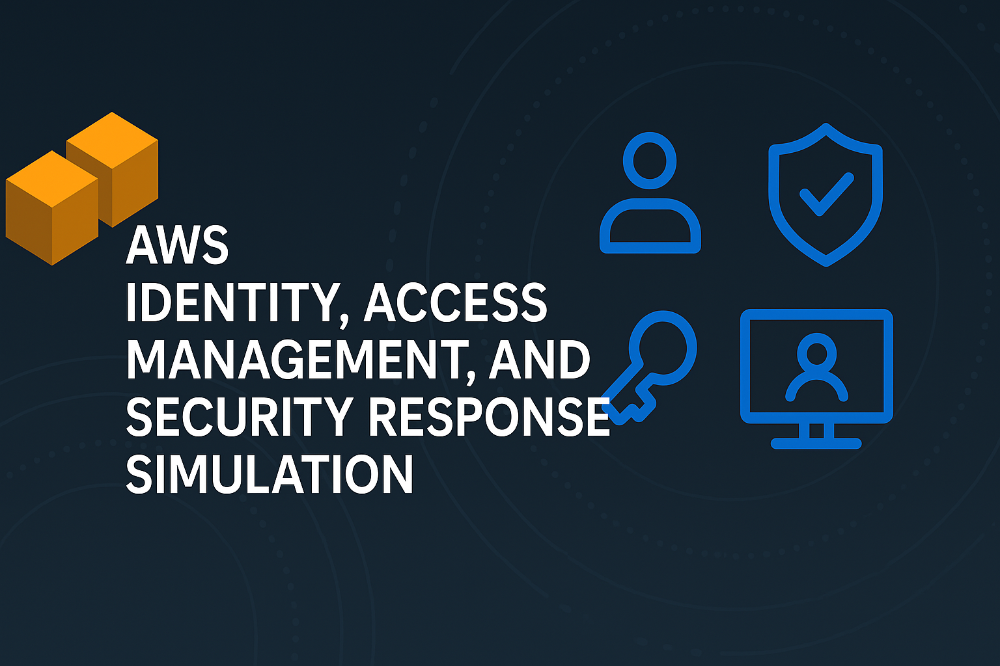

### **Security with AWS: Identity and Access Management (Project summary)**

By Austin O'Dell

{width="6.5in"
height="4.333333333333333in"}

This hands-on AWS project using both AWS CLI and AWS Console focused on
implementing strong security practices using Identity and Access
Management (IAM), simulating real-world threats like credential leaks
and appropriate responses, and enforcing policies to prevent privilege
escalation. The project highlights both preventative and reactive
security strategies aligned with AWS best practices.

### **Key Activities Performed**

1.  **Root User Protection and Administrative Setup**

    a.  Enforced **MFA on the root user** to prevent unauthorized
        access---a critical AWS best practice.

    b.  Created a **dedicated SecurityTeamAdmin IAM user** for
        administrative tasks, avoiding direct use of the root account.

    c.  Configured **AWS CLI access** via secure access keys for
        programmatic management.

2.  **User, Group, and Policy Configuration**

    a.  Created IAM users (Matt, Sarah, and Deborah) and grouped them
        under CloudSecurityTeam.

    b.  Attached **managed policies** like AmazonS3FullAccess, and
        created **custom read-only policies** to enforce least
        privilege.

    c.  Used the **policy simulator** to verify effective permissions
        and troubleshoot access issues.

3.  **IAM Role Management and Trust Relationships**

    a.  Created and attached an IAM role (EC2toS3) to an EC2 instance,
        granting it controlled access to S3 resources.

    b.  Used instance metadata service to demonstrate how roles work
        with temporary security credentials.

    c.  Created a **cross-account IAM role (AuditFinData)** for external
        auditors with read-only access to specific S3 data, using
        **trust policies** and **external IDs** to enforce secure
        delegation and third-party access control.

4.  **Simulated Security Incident: Credential Leak**

    a.  Simulated the **theft of EC2 instance role credentials** by
        extracting them via the metadata service.

    b.  Reproduced attacker behavior using stolen credentials to access
        S3.

    c.  Responded by **revoking the active session** under IAM \> Roles
        to invalidate the leaked session---demonstrating real-world
        security incident response.

5.  **Enforcing Privilege Boundaries**

    a.  Created and applied a **permission boundary**
        (IAMPermissionBoundaryLimitAdmin) to prevent administrators like
        the new James user from escalating their own or others\'
        privileges.

    b.  Demonstrated that even with IAMFullAccess, the permission
        boundary restricts dangerous actions like creating new admins or
        modifying privileged policies.

    c.  Also applied targeted **deny policies** to users like Matt to
        block specific actions (e.g., S3 bucket creation), reinforcing
        the \"explicit deny overrides allow\" principle.

6.  **Best Practice Demonstrations**

    a.  Leveraged **temporary credentials** with IAM roles instead of
        long-term access keys.

    b.  Utilized **role switching**, **external IDs**, and **session
        revocation** for controlled access and incident response.

    c.  Cleaned up all resources at the end of the project to follow
        good cloud hygiene practices.

### **Lessons Learned**

-   **MFA is essential** for root and high-privilege users to prevent
    unauthorized access.

-   **Least privilege** is best enforced through a combination of group
    policies, permission boundaries, and explicit denies.

-   **IAM roles with temporary credentials** are safer than long-term
    access keys, particularly for EC2 and third-party access.

-   **Proactive controls** (permission boundaries, external IDs) and
    **reactive tools** (session revocation) are both critical for cloud
    security.

-   **Credential leaks are real threats** and must be mitigated
    immediately with revocation and monitoring.

### **AWS Best Practices Demonstrated**

-   Never use the root user for daily tasks---protect it with MFA.

-   Use IAM roles and temporary credentials wherever possible.

-   Apply the **principle of least privilege** with scoped policies and
    permission boundaries.

-   Utilize **external IDs** to secure third-party cross-account access.

-   **Monitor, simulate, and prepare** for real-world attacks like
    credential theft.

-   Always **revoke sessions** and rotate credentials when compromise is
    suspected.
